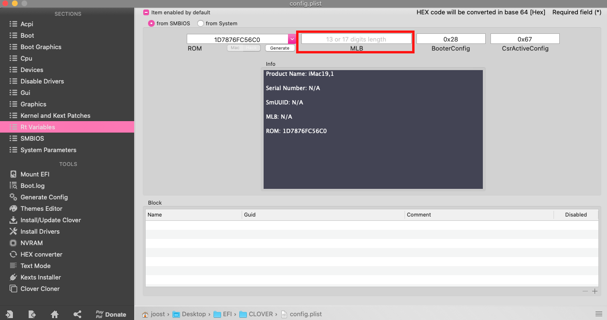
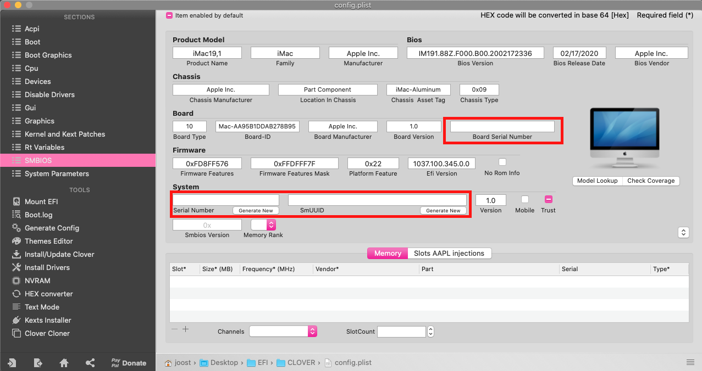
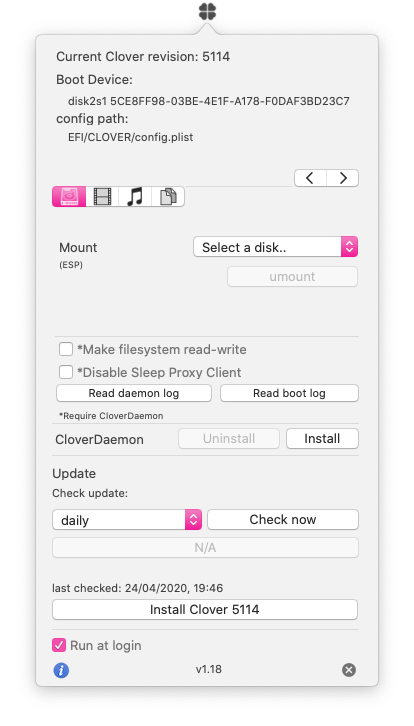

# Z390-Hackintosh-Joost
Joost's EFI for Hackintosh on Z390 Designare, i7, RX 570, 32GB RAM and Fenvi T919

# Latest Changes in uploaded EFI:
(Item 0 is the oldest):

0. Installed my system succesfully
1. Updated succesfully to Supplemental Update for 10.15.4
2. Updated Kexts
3. Updated to Clover R5112
4. Updated Kexts and update to Clover R5113
5. a. Updated to Clover R5114
   b. Updated SSDT to go with the onboard Bluetooth chip, as per Kext in development: https://github.com/zxystd/IntelBluetoothFirmware/releases/
6. NOTE: Switched from the Fenvi card to the onboard WiFi & Bluetooth module using (beta) kext (itlwm.kext) and physically removed the Fenvi card from my PC. This is a test, but if you use the Fenvi card, I think it still works. So feel free to use what you want. See below references site to use the Kext option. 
7. Updated Kexts and update to Clover R5119 and update to 10.15.6 (19G73)
7a. 16-7-2020 12h48 Z390 10.15.6 R5119 NoSN.zip
   
   
# PC specifications:
- OS's installed: Catalina 10.15.X dualbooted with Windows 10 Pro
- PC Case: Fractal Design Define R6 USB-C TG
- Processor: Intel Core i7 9700K, 9th Gen (Code name: Coffee Lake)
- Motherboard: Gigabyte Z390 Designare
- Sound card (onboard): ALC 1220-VB audio controller
- SSD storage: Crucial Crucial MX500, 1TB 
- Graphic card: Sapphire Nitro+ Radeon RX 570 4GD5
- Fenvi T919 for WiFi/Bluetooth, AirDrop etc. I'm using the Z390 MoBo onboard Bluetooth chip to use bluetooth. So currently hand-off, airdrop etc. is working because of WiFi on T919 and Bluetooth on Z390.
- Power Supply: Be quiet! Dark Power PRO 11 850W
- Memory (RAM): Corsair Vengeance LPX (2x 16GB, total 32GB)
- Cooling system: Cooler Master ML360R RGB 
- Stably overclocked the CPU at 5GHz, 1.3 Volt. According: https://www.youtube.com/watch?v=6Sk4ISqmL88
  - Temperature IDLE (Still doing basic things ie. Music on, using Safari etc.): 30 degrees Celcius
  - Stress tested: 50-60 degrees Celcius:
  
 
  

# Confirmed working
-	CPU, RAM, Fans, Cooling etc.
- Video
-	Ethernet
-	Sound
- AirDrop (Fenvi)
- WiFi (Fenvi)
- Bluetooth (Fenvi, but I'm using the Z390 Bluetooth chip)
- Install apps by authorizing from Apple Watch
- USB ports
- Display Port (onboard and RX 570)
- HDMI (onboard and RX 570)

* Unlock with Apple Watch
* Apple Pay
* Sidecar
* Continuity Camera

It's all working 100% now - What did I do (Credits to CaseySJ)?
* Shutdown iPad, iPhone, Apple Watch
* Restart iPad, iPhone, Apple Watch
* Log out of iCloud on iPad
    * When iOS asked if I wanted to delete local copies of various items I said yes
    * Everything was on iCloud anyway
* Log out of iCloud on iPhone
    * When iOS asked if I wanted to delete local copies of various items I said yes
    * Everything was on iCloud anyway
* Log back into iCloud on iPad
* Log back into iCloud on iPhone
Then on Hackintosh:
* Logout of iCloud
    * When macOS asked if I wanted to delete local copies of various items I said yes
    * Everything was on iCloud anyway
* Reboot
* Log back into iCloud
* Then shutdown, remove power plug, wait full 5 minutes.
    * You may not need to wait so long... I was just doing other things...
* Reconnect and power up.

# Notes:
- I'm not responsible for any harm done to your PC :-) Use my experiences and EFI at your own risk.
- Everything I did went according @CaseySJ his outstanding guides on:
https://www.tonymacx86.com/threads/success-gigabyte-designare-z390-thunderbolt-3-i7-9700k-amd-rx-580.267551/
- I didn’t change/add anything to 'Library/Extensions' folder. For kexts, I only used the 'EFI/CLOVER/kexts/Other/' folder.

# Kexts:
Make sure (!) you are using the latest kexts from the internet: 

- FakeSMC.kext (Only install FakeSMC.kext, nothing else)
https://bitbucket.org/RehabMan/os-x-fakesmc-kozlek/downloads/
- USBInjectAll.kext
https://bitbucket.org/RehabMan/os-x-usb-inject-all/downloads/
- Lilu.kext
https://github.com/acidanthera/Lilu/releases
- WhateverGreen.kext
https://github.com/acidanthera/WhateverGreen/releases

For convenvience purposes, use either Clover Configurator or Hackintool to mount EFI and update the Kexts.

# BIOS Settings (from tonymacx86.com):
https://www.tonymacx86.com/threads/success-gigabyte-designare-z390-thunderbolt-3-i7-9700k-amd-rx-580.267551/

# Work Procedure:
https://www.tonymacx86.com/threads/success-gigabyte-designare-z390-thunderbolt-3-i7-9700k-amd-rx-580.267551/

# Serial number:
You need to make your own serial number, so that your iCloud etc. will work without using someone else his serial number.
I removed the following:

You need to create your own Serial Number, etc. according:
https://www.tonymacx86.com/threads/success-gigabyte-designare-z390-thunderbolt-3-i7-9700k-amd-rx-580.267551/

# Updating Hackintosh
https://www.tonymacx86.com/threads/success-gigabyte-designare-z390-thunderbolt-3-i7-9700k-amd-rx-580.267551/
- In general; watch others do first to see if they succeed: 
- Make sure first to install the latest Kext files
- Install latest Clover; but first make sure that this works according other users. Latest Clover build:
https://github.com/CloverHackyColor/CloverBootloader/releases

# EFI ZIP file:
Download here. The EFI is without my serial number:
https://mega.nz/folder/09QwCAZC#fQdj7cn-LnhvIMJlSm7t3w

# Extras
- Hide unneeded volumes in Clover with Clover Configurator. I've hide the following volumes:

# Resources
https://www.tonymacx86.com/threads/success-gigabyte-designare-z390-thunderbolt-3-i7-9700k-amd-rx-580.267551/
Onboard WiFi+Bluetooth Kext (BETA): https://www.tonymacx86.com/threads/success-working-intel-wifi-drivers-for-7265ac-on-catalina.292207/post-2131153
https://github.com/CloverHackyColor/CloverBootloader/releases
https://www.tonymacx86.com/resources/clover-configurator.429/ 
https://hackintosh.gitbook.io 
https://www.tonymacx86.com/threads/how-to-create-a-macos-catalina-public-beta-installation-usb.278188/
https://www.tonymacx86.com/threads/unibeast-install-macos-mojave-on-any-supported-intel-based-pc.259381/#uefi_settings

# BIG SUR BETA on OpenCore
So, I made an effort by installing Big Sur on a separate SSD. So far it's working very well. A small how-to here: 

PRECAUSION:
- This is in testing phase, but it's working remarkably well so far. 
- Currently using Big Sur Beta 3.
- I'm using OpenCore 0.6.0 (which is a beta). You can download latest build from here which you can use during the EFI creation as per below: https://github.com/williambj1/OpenCore-Factory/releases
- Also great info from: https://dortania.github.io/OpenCore-Install-Guide/extras/big-sur/#backstory

- USB preparation and installation of Big Sur according this video:
https://www.youtube.com/watch?v=J22vqnS-QZ4&t=2s
- Create your EFI:
https://www.youtube.com/watch?v=XyDJMNMFi6I&t=58s
- When the EFI is done, add your SSDT's and DTSD's to the EFI partition using CloverConfigurator to mount the EFI
- After that, create your own Serial Number using CloverConfigurator

# Latest Changes in uploaded Big Sur EFI (without a Serial Number):
(Item 0 is the oldest):

0. Installed my system succesfully using OpenCore 0.6.0
1. Tweaked it
2. Updated to Beta 3
2b. 30-7-2020 15h42 OC060 BigSurB3 NoSN.zip
3. Updated OpenCore from scratch to OpenCore 0.6.0 commitment 0e81540 via: https://github.com/williambj1/OpenCore-Factory/releases
3a. 2-8-2020 11h09 OC060 new BigSurB3 NoSN.zip

Download my latest Big Sur EFI here:
https://mega.nz/folder/l9xGHQQC#63JkmaR5IT3ONQ4G1RmfLQ

The following is working on macOS Big Sur so far:
Audio ✔
Ethernet ✔
Graphics ✔
HDMI ✔
Sleep/wake Function ✔
Power Management ✔
App Store ✔
iMessage ✔
iCloud ✔
FaceTime ✔
USB with 2.0, 3.0, 3.1 and USB Type-C Ports ✔
Bootloader ✔
HDMI Audio ✔
Volume Hotkeys ✔
AirDrop ✔
HandOff ✔
Side Car (in progress, getting a black screen on iPad)

